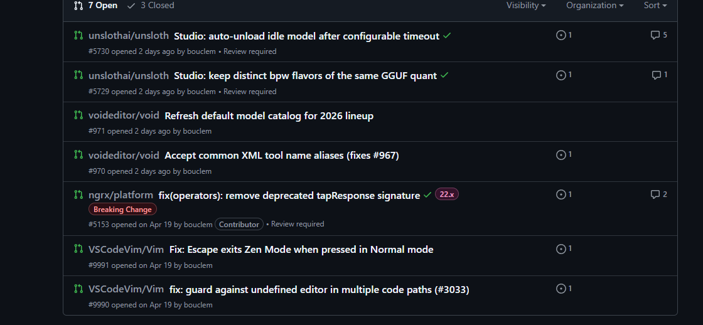

# Klem · Voidware Labs

Solo dev from France. I work on AI, low-level systems, hardware, language design, and tooling.

Site: [voidware.xyz](https://voidware.xyz)

## Projects

**[vdx](https://voidwarelang.xyz)** — a compiled, statically typed language. Java/C++/Rust influences. Goal is self-hosting. Currently v0.0.8, ships as a Windows `.msi`.

**[Fake-Stock-Market-Generator](https://github.com/bouclem/Fake-Stock-market-Generator)** — small npm package I made to generate fake stock market data.

**[SKILLS](https://github.com/bouclem/SKILLS)** — collection of AI skills I've downloaded and use, with maybe a few I made myself in the mix.

## Research

I'm working on **VUAF** (Void Ultimatus Architecture Fusion) — a tiny hybrid language model that fuses a few research ideas into one stack: RWKV-7 recurrent memory, Mamba-2 SSD layers, a single Jamba-style sparse attention layer, top-1 sparse MoE, an Ouro-style parameter-shared loop, and a PonderNet halt head so the model learns to stop looping when a token is easy.

The first checkpoint, [VUAF-Pico](https://huggingface.co/Sqersters/vuaf-pico), is ~2.46M parameters. Very experimental, very small, mostly an ablation playground. Weights are open (Apache-2.0), training code is not.

From my own testing: outputs aren't coherent sentences yet, but you can already pick out real English words and fragments inside the noise — which is honestly more than I expected from 2.46M params.

Sample run (`vuaf chat`, prompt: `hello`):

```
tookspecificdeeplistmostfix2.oustmonsteriddachedpostountsysicesidgeazinewaitreadensplayedindbeing','etsflowerrideopert$soonittoffdoneIfriptionicense<|cat:_reserved_8|>gu[0estivalisionButslidealчerseatOctttimed
[avg loop step=3.0, n=50]
```

Words you can pick out in there: `took`, `specific`, `deep`, `list`, `most`, `fix`, `monster`, `post`, `wait`, `read`, `played`, `being`, `flower`, `ride`, `soon`, `done`, `If`, `license`, `But`, `slide`, `at`, `Oct`, `timed`.

## AI

**IDE** — I use [Kiro](https://kiro.dev) as my main AI IDE.

**Models I've made**
- [Sqersters/vuaf-pico](https://huggingface.co/Sqersters/vuaf-pico) — first VUAF checkpoint (~2.46M params, hybrid RWKV-7 / Mamba-2 / Jamba / Ouro / PonderNet)

## Contributions

I open PRs on projects I use when I run into a bug or a missing feature.

### Open



Currently waiting on review:
- [ngrx/platform](https://github.com/ngrx/platform) — fix(operators): remove deprecated tapResponse signature
- [unslothai/unsloth](https://github.com/unslothai/unsloth) — Studio: auto-unload idle model + keep distinct bpw flavors of GGUF quants
- [voideditor/void](https://github.com/voideditor/void) — Refresh default model catalog + accept common XML tool name aliases
- [VSCodeVim/Vim](https://github.com/VSCodeVim/Vim) — Fix Escape in Zen Mode + guard against undefined editor in multiple paths

### Merged


- [ngrx/platform](https://github.com/ngrx/platform) — fix(data): remove QueryParams deprecation warning

## Stack

C, C++, Rust, Java, x86_64 ASM, Python, vdx, Amaranth HDL, Yosys, OpenROAD, HIP/ROCm.

## Links

- [voidware.xyz](https://voidware.xyz)
- GitHub: [@bouclem](https://github.com/bouclem)
- X: [@Sqersters_](https://x.com/Sqersters_)
- Skills repo: [bouclem/SKILLS](https://github.com/bouclem/SKILLS)
